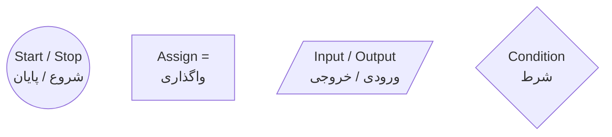
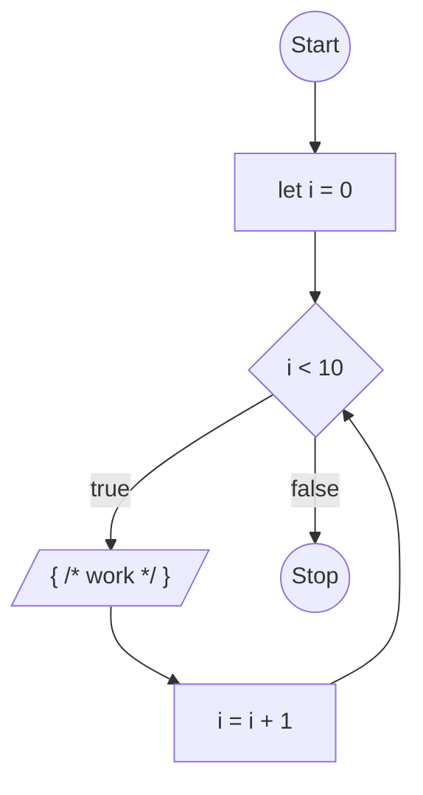

# Flowchart


```mermaid
graph TD
 A((Start / Stop\nشروع / پایان))
 B["Assign = \nواگذاری"]
 C[/"Input / Output\nورودی / خروجی"/]
 D{ Condition\nشرط }
```

## `for` Loop

```js
for (let i = 0; i < 10; i = i + 1) {
   /* work */
}
```


```mermaid
graph TD
 A((Start)) --> B[let i = 0] --> C{i < 10}
 C --> |true| D[/"{ /* work */ }"/]
 D --> E[i = i + 1]
 E --> C
 C --> |false| F((Stop))
```
