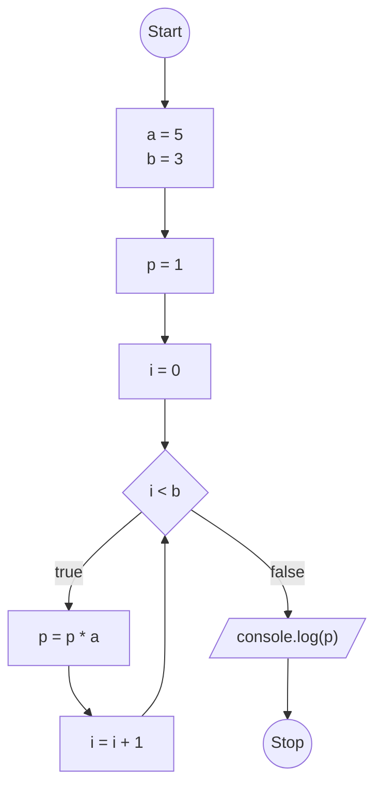

# فلوچارت سوال اول (کد توان)

```js
let a = 5;
let b = 3;
let p = 1;
for (let i = 0; i < b; i++) {
	p *= a;
}
console.log(p);
```


```mermaid
flowchart TD;
   A((Start))
   --> B["a = 5\nb = 3"]
   --> D[p = 1]
   --> E[i = 0]
   --> F{i < b}
   --> |true| G["p = p * a"]
   -->  H["i = i + 1"]
   --> F
   F --> |false| I[/"console.log(p)"/] 
   -->J((Stop))
```

