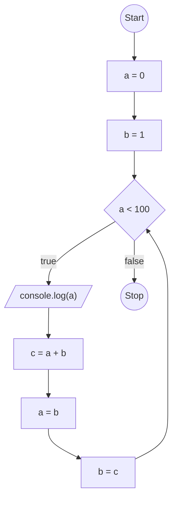

# تکلیف جلسه 6

## سوال اول

بدون استفاده از عملگر توان (`**`)، برنامه‌ای بنویسید که `a` به توان `b` را محاسبه کند.

```js
let a = 5;
let b = 3;
```

## سوال دوم

فلوچارت کد سوال اول را رسم کنید.

## سوال سوم

فلوچارت زیر را به کد تبدیل کنید:



## سوال چهارم

برنامه‌ای بنویسید که بر اساس عدد داده شده خروجی‌های زیر را نمایش دهد.

```js
let n = 5;
```

`# # # # # `

`-@--@---@----@-----@`
