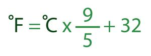

تکلیف جلسه 3
=


سوال اول
-



با استفاده از فرمول داده شده برنامه‌ای بنویسید که مقدار متغیر زیر را از سانتیگراد (سلسیوس) به فارنهایت تبدیل کند.
```js
let c = 28;
```
 سوال دوم
 -

برنامه‌ای بنویسید که بر اساس متغیر `lang` به آن زبان روی صفحه کلمه‌ی *«سلام»* را بنویسد. `lang` می‌تواند یکی از این مقادیر باشد: `English, Kurdish, Persian, Arabic`
اگر مقدار `lang` هیچ کدام از این زبان‌ها نبود، به انگلیسی *Hello* نمایش بدهد.
```js
let lang = 'English';
```

سوال سوم
-
برنامه‌ای بنویسید که بر اساس مختصات زیر، فاصله‌ی دو نقطه را محاسبه کند. مثلا اینجا فاصله‌ی دو نقطه حدود 9.22 است.
```js
let x1 = 1, y1 = 0;
let x2 = 8, y2 = 6;
```

سوال چهارم
-
با توجه با اینکه در تابع `round` جاواسکریپ نمی‌توان تعداد رقم‌های اعشار را برای گرد کردن تعیین کرد، برنامه‌ای بنویسید که عدد `n` را به تعداد رقم `d` گرد کند و مثلا اینجا عدد 3.14 را نمایش بدهد.

```js
let n = 3.14159;
let d = 2;
```